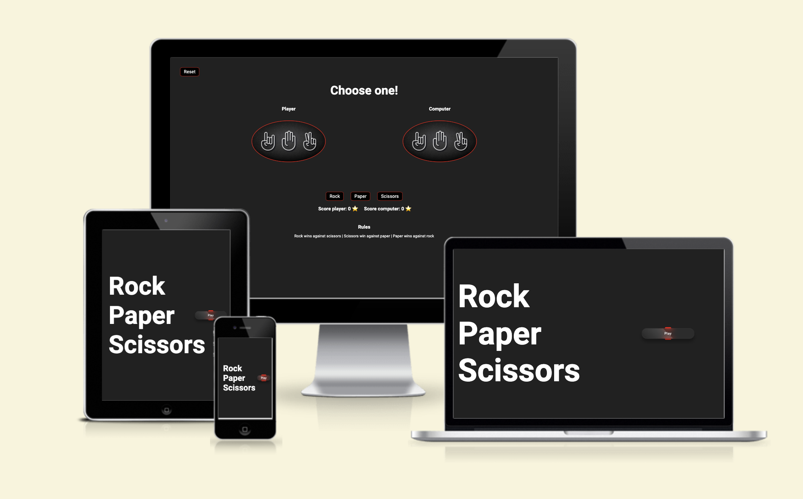

# PP2 RPC-GAME

The website is a simple implementation of a Rock-Paper-Scissors game.

## Game Description

- The Rock-Paper-Scissors game is a classic hand game played between two players. Each player simultaneously chooses one of three options: rock, paper, or scissors. The outcome of the game is determined by the choices made by the players:

- Rock beats scissors
- Scissors beats paper
- Paper beats rock

## User Experience (UX)

- The website has a simple and clean visual design that is intuitive and easy to understand. The color scheme is minimalistic, primarily using shades of gray and white for the background, with contrasting black text and icons. The use of a limited color palette helps to maintain focus on the game itself.

- The options to choose from (Rock, Paper, and Scissors) are clearly displayed and easily distinguishable. Each option is represented by an icon that accurately represents the corresponding object. The icons are visually appealing and help users quickly identify their choices.

- The result of the game is displayed using visually distinct messages. When the user wins, the message is displayed in green, while a red message indicates a loss.

<!-- 
## Design

### Color scheme

I used <a href="https://coolors.co/000000-545454-999999-ffffff" target="_blank">Coolors.co</a> to generate my colour palette.

### Typography

- <a href="https://fonts.google.com/" target="_blank">Google Fonts</a> were used to import 'Lato', sans-serif into style.css.
- The text on the website is well-justified, which means that it is aligned evenly on both sides, creating a clean and professional appearance.

## Features

The website is comprised of three pages, all accessible from the navigation menu (Home, About and Sign up).

### Existing Features

## Navigation Bar

- Navbar include links to the websites Home page, About page, Sign up page and a Eniac logo.
- On left, Eniac logo when is select is will back to home page.
- On right, there are three elements clearly state the content of each page.

## Home Page

The main content of the home page is organized into sections, each with a heading and some text describing the section's content.

The home page of the website features a title "ENIAC: The First General-Purpose Electronic Digital Computer" overlaid on top of it.

- This section there is a brief introduction to the website, which provides some background information about the ENIAC and its historical significance.

- This section below provide information about the specific goal the ENIAC was designed, includes an image and a button "READ MORE" that interact with ABOUT PAGE on the website.

- This section there are a video of University of Pennsylvania  and also a text explaining about ENIAC.

### Footer

- The footer is fixed to bottom all pages.
- Links to the main social media.

### About Page

On the ABOUT PAGE we have an explanatory text about ENIAC followed by four images with descriptions.

### Sign up

On Sign up page the users can subscribe to receive more history content.

## Future Features

### Visual Enhancements

- We will add more visual elements to the website, such as images, videos, or animations. This  will  help to make the website more engaging and visually appealing.

### Feedback System

- We will add a feedback system that would allow users to provide feedback or report bugs. This would help to improve the quality of the project and provide users with a better experience.

## Tools & Technologies Used

- [HTML](https://en.wikipedia.org/wiki/HTML) used for the main site content.
- [CSS](https://en.wikipedia.org/wiki/CSS) used for the main site design and layout.
- [CSS Flexbox](https://www.w3schools.com/css/css3_flexbox.asp) used for an enhanced responsive layout.
- [Git](https://git-scm.com) used for version control. (`git add`, `git commit`, `git push`)
- [GitHub](https://github.com) used for secure online code storage.
- [GitHub Pages](https://pages.github.com) used for hosting the deployed front-end site.
- [Gitpod](https://gitpod.io) used as a cloud-based IDE for development.
- [Markdown Builder](https://traveltimn.github.io/markdown-builder/) used to help generate the Markdown files.
- [Am I Responsive?](https://ui.dev/amiresponsive) used to show the website on a range of devices.

## Testing

For all testing, please refer to the [TESTING.md](TESTING.md) file.

## Deployment

The site was deployed to GitHub Pages. The steps to deploy are as follows:

- In the [GitHub repository](https://github.com/Godinhoweverson/PP1_Eniac_First_Computer), navigate to the Settings tab
- From the source section drop-down menu, select the **Main** Branch, then click "Save".
- The page will be automatically refreshed with a detailed ribbon display to indicate the successful deployment.

The live link can be found [here](https://godinhoweverson.github.io/PP1_Eniac_First_Computer/)

### Local Deployment

This project can be cloned or forked in order to make a local copy on your own system.

#### Cloning

You can clone the repository by following these steps:

1. Go to the [GitHub repository](https://github.com/Godinhoweverson/PP1_Eniac_First_Computer)
2. Locate the Code button above the list of files and click it
3. Select if you prefer to clone using HTTPS, SSH, or GitHub CLI and click the copy button to copy the URL to your clipboard
4. Open Git Bash or Terminal
5. Change the current working directory to the one where you want the cloned directory
6. In your IDE Terminal, type the following command to clone my repository:
	- `git clone https://github.com/Godinhoweverson/PP1_Eniac_First_Computer.git`
7. Press Enter to create your local clone.

Alternatively, if using Gitpod, you can click below to create your own workspace using this repository.

Please note that in order to directly open the project in Gitpod, you need to have the browser extension installed.
A tutorial on how to do that can be found [here](https://www.gitpod.io/docs/configure/user-settings/browser-extension).

#### Forking

By forking the GitHub Repository, we make a copy of the original repository on our GitHub account to view and/or make changes without affecting the original owner's repository.
You can fork this repository by using the following steps:

1. Log in to GitHub and locate the [GitHub Repository](https://github.com/Godinhoweverson/PP1_Eniac_First_Computer)
2. At the top of the Repository (not top of page) just above the "Settings" Button on the menu, locate the "Fork" Button.
3. Once clicked, you should now have a copy of the original repository in your own GitHub account!

## Credits

### Content

| Source | Location | Notes |
| --- | --- | --- |
| [Markdown Builder](https://traveltimn.github.io/markdown-builder) | README and TESTING | tool to help generate the Markdown files |
| [W3Schools](https://www.w3schools.com/howto/howto_js_topnav_responsive.asp) | entire site | responsive HTML/CSS/ navbar|
| [W3Schools](https://www.w3schools.com/html/html_forms.asp) | sign up page | form and input element |
| [Flexbox Froggy](https://flexboxfroggy.com/) | entire site | modern responsive layouts |
| [Flexbox](https://css-tricks.com/snippets/css/a-guide-to-flexbox/) | entire site | modern responsive layouts |

### Media

| Source | Location | Type | Notes |
| --- | --- | --- | --- |
| [Pexels](https://www.pexels.com) | entire site | image | on all pages |
| [Lorem Picsum](https://picsum.photos) | home page | image | on all pages|
| [Wikipedia](https://www.wikipedia.org/) | Content | text | search source |
| [Youtube](https://www.youtube.com/watch?v=k4oGI_dNaPc) | home page | video | video on fourth-container |

### Acknowledgements

- I would like to thank the [Code Institute Slack community](https://code-institute-room.slack.com) for the technical support.
- I would like to thank my wife Deborah, for believing in me, and allowing me to make this transition into software development. -->
