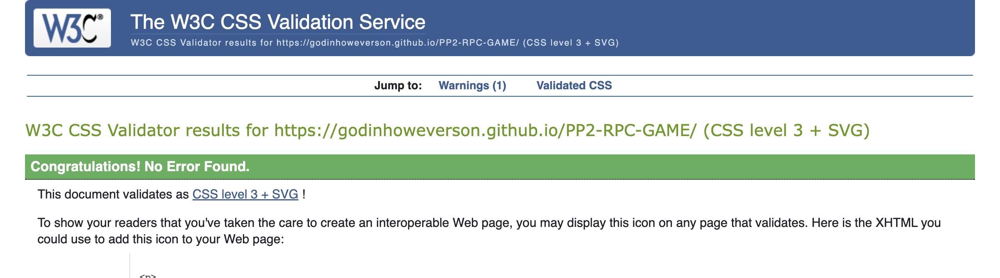

### Testing

- I tested that this page works in different browsers: Chorme, Firefox, Safari.

## W3C HTML Validator

- HTML
  - I have used <a href="https://validator.w3.org/" target="_blank">HTML W3C Validator.</a>
  - No error.


## W3C CSS Validator (Jigsaw)

- Css
  - I have used <a href="https://jigsaw.w3.org/css-validator/" target="_blank">CSS Jigsaw Validator.</a>
  
  - No error
  
  

### Lighthouse

## Desktop

  - No major issues.

    


## Mobile

  - No major issues.

    
  

### Accessibility

- I have used <a href="https://wave.webaim.org/" target="_blank">Wave.</a>
- All pages tested no error found.

   
````````````````````````````````````````````````````````````````````````````````````````````````````